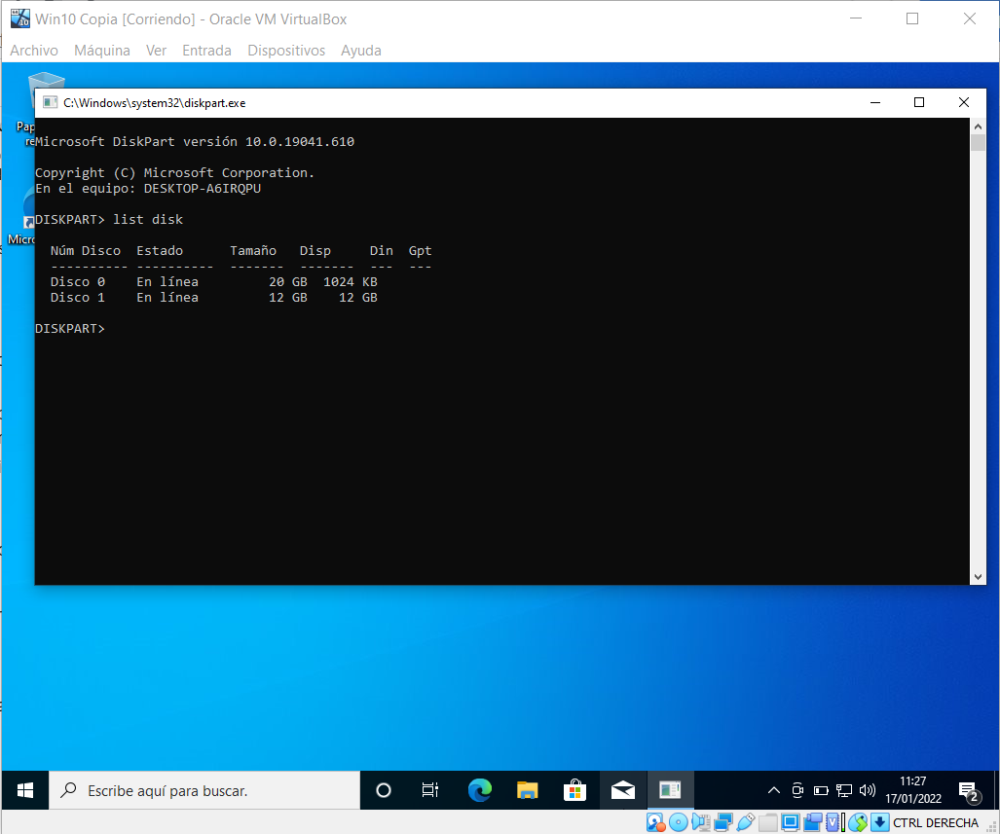
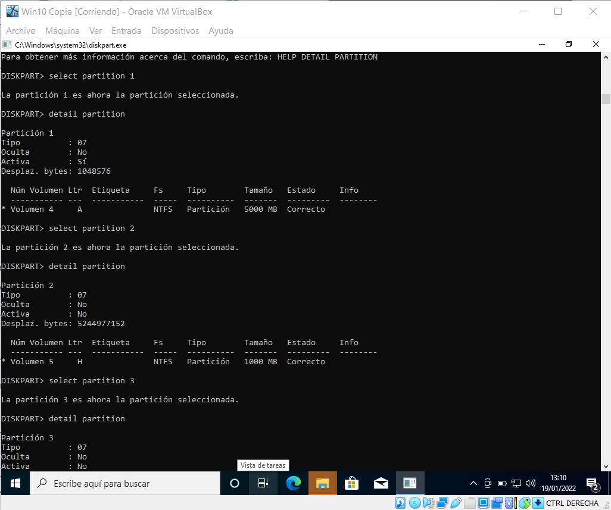

#Trabajo propuesto RA2: Particiones de disco y copias de seguridad
##Información básica/situación
| Requisitos | 1 equipo con VirtualBox instalado y conexión a internet |
| ----------- |:------------:|
***
##Parte 1: Particiones de disco utilizando herramientas  por comandos diskpart.
* _Inserta un segundo disco duro de 12 GB en la máquina virtual Windows 10 generada en el tema anterior.
Utilizando la herramienta diskpart, realiza las siguientes operaciones sobre el segundo disco de la máquina virtual. Haz una captura de pantalla por cada apartado del comando usado y el resultado._
1. ¿Qué número tienen asignados cada uno de los discos?

2. Elimina todas las particiones creadas en el segundo disco

3. Crea dos particiones una primaria (5 GB)  y una extendida (5 GB) con dos unidades lógicas, cada una de 1 (GB).

4. Asignarles una letra a cada una.

5. Formatearlas.

6. Visualiza la información relativa a cada una de las particiones con cada herramienta. Pega la captura de pantalla correspondiente.

7. Borra la segunda unidad lógica y redimensiona la primera unidad lógica para que ocupe 3GB.

**Webs de ayuda**
[Enlace1](http://technet.microsoft.com/es-es/library/cc770877%28v=ws.10%29.aspx)
[Enlace2](https://www.profesionalreview.com/2019/01/18/utilizar-diskpart/)
[Enlace3](https://www.youtube.com/watch?v=KTsIF54ngWY)
[Enlace4](https://www.geeknetic.es/Guia/1723/Diskpart-Todos-los-Comandos-y-Como-se-Usan.html)